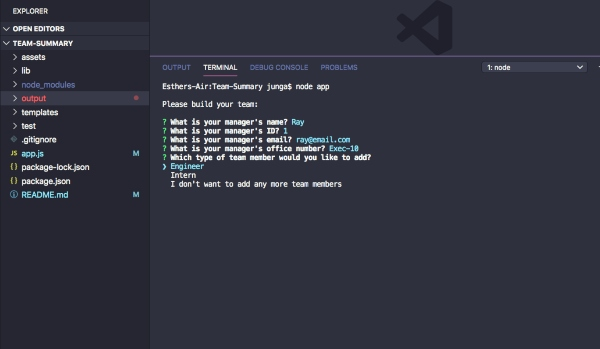
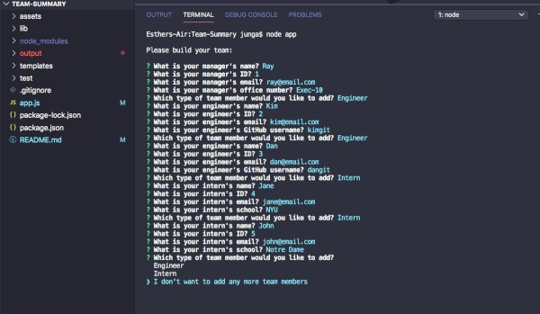
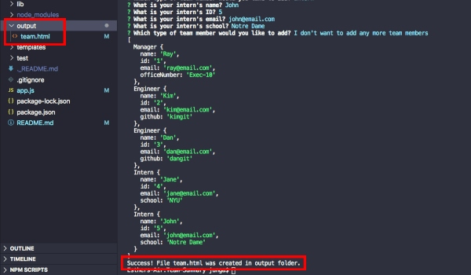
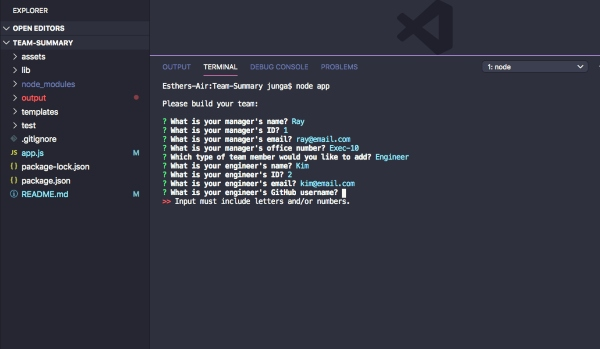

# Team-Summary
This Node CLI utilizes the [Inquirer package](https://www.npmjs.com/package/inquirer) to take in information for 3 types of employees (manager / engineer / intern). From this information, an HTML webpage is generated that displays each individual's name, role, id and email. This app also makes use of ES6 classes to take in a role-specific property that is displayed. Role-specific properties include the office number for the manager, a GitHub profile link for engineers, and a school name for interns.


## Table of Contents
* [Installation](#Installation)
* [Usage](#Usage)
* [Demo](#Demo)
* [Tests](#Tests)
* [Contact](#Contact)


***
## Installation

Dependencies include:
- Inquirer for collecting input
- Jest for running provided tests

To install necessary dependencies, run the following command:
``` 
npm i 
``` 

***
## Usage
- After the installation, run the following command:
```
node app
```
- Provide information for the manager as prompted.

<div style="text-align:center"></div>

- When prompted, select 'engineer' or 'intern' to add a new employee for that corresponding role. You may add as many engineers and interns as you like.

<div style="text-align:center"></div>

- When you are finished adding your team members, select 'I don't want to add any more team members' to exit the app.

<div style="text-align:center"></div>

- The message `"Success! File team.html was created in output folder."` should pop up in your terminal, and a new team.html should be in your output folder.

<div style="text-align:center"></div>

<br>

## Validation

Below are the inputs that each field takes in:
- **Name:**  Lowercase and uppercase letters 
- **Id:**  Numbers
- **Email:**  Valid email format (e.g. email@example.com)
- **Office Number:**  Numbers, lowercase and uppercase letters. Acceptable special characters include '_' and '-'
- **GitHub username:**  Numbers, lowercase and uppercase letters. Acceptable special characters include "_" and '-'
- **School:** Lowercase and uppercase letters

You will get an error message if any character types are entered other than the ones specified for each of the fields above.

<div style="text-align:center"></div>
<br>
<br>

***
## Demo


<br>

***
## Tests
The test folder includes a file that will use [jest](https://jestjs.io/) to test that the Employee, Manager, Engineer and Intern classes are behaving as expected. 

Run the following command to run the test: 
```
npm test run
```


***
## Contact
- **GitHub:**  [jungjungie](https://github.com/jungjungie)
- **Portfolio:**  [https://jungjungie.github.io/](https://jungjungie.github.io/)